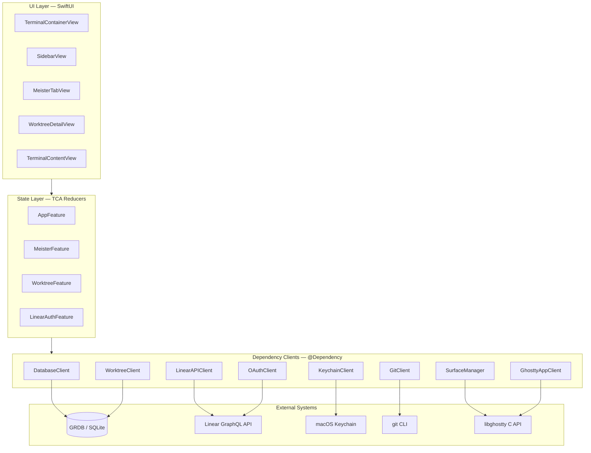
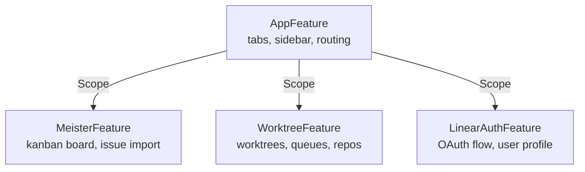
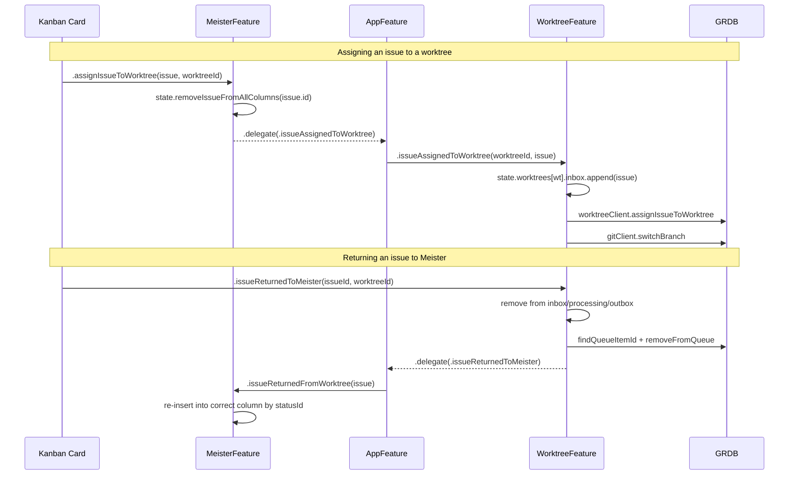
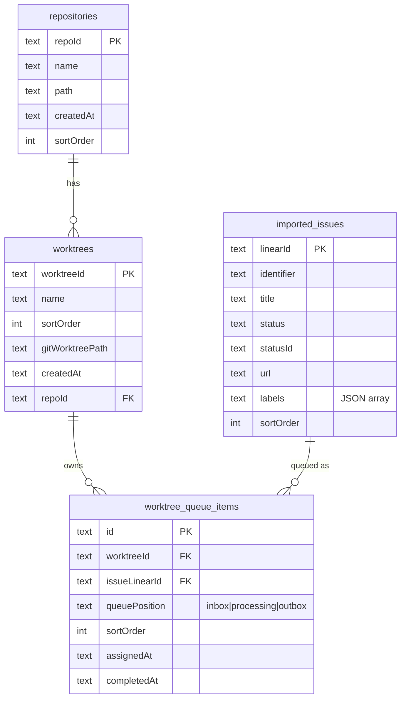
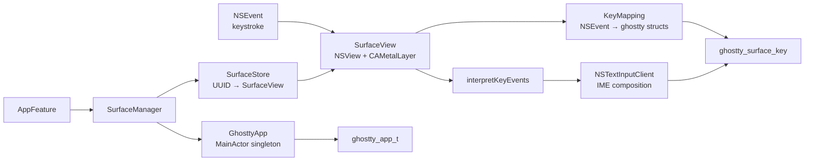
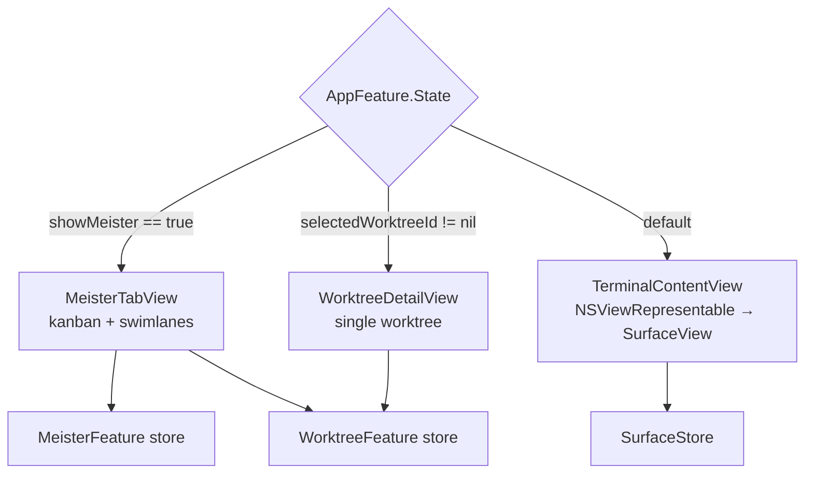

# Klausemeister Architecture

Klausemeister is a native macOS app that combines a **libghostty-powered terminal** with a **TCA-driven project management layer** (Linear issues, git worktrees, kanban board). The app is a thin Swift shell over libghostty's C API for terminal emulation, wrapped in a Composable Architecture state machine for everything else.

## Layer Overview



Everything above the Dependencies layer is pure Swift value types. All I/O, process spawning, and C FFI happens inside dependency clients, keeping reducers deterministic and testable.

## TCA Feature Hierarchy



`AppFeature` is the composition root. It owns top-level UI state (tab list, sidebar visibility, active tab, Meister/worktree routing) and composes the three child reducers via `Scope`. It also forwards tab keyboard shortcuts (Cmd+1–9) and orchestrates `SurfaceManager` focus lifecycle as the user switches between terminal tabs, the kanban board, and worktree detail views.

## Cross-Feature Coordination

Features never reach into each other's state directly. Cross-feature events use **TCA delegate actions** that the parent reducer (`AppFeature`) intercepts and re-dispatches to the sibling feature.



Both directions keep state **immediately consistent** via optimistic mutations, then persist asynchronously. Errors roll back in failure actions.

## Dependency Clients

All external systems are accessed via TCA `@Dependency` clients. Each is a `struct` of `@Sendable` closures with a `liveValue` and a `testValue` that uses `unimplemented(...)`.

| Client | Purpose | Backing |
|---|---|---|
| `DatabaseClient` | GRDB queue + imported issue CRUD + filtered queries | SQLite via GRDB |
| `WorktreeClient` | Worktree/repository/queue-item CRUD | Same DB queue |
| `LinearAPIClient` | Linear GraphQL (issues, workflow states, updates) | `URLSession` + bearer token |
| `OAuthClient` | PKCE OAuth flow for Linear login | `NSWorkspace.open` + callback URL stream |
| `KeychainClient` | Access/refresh token storage | Keychain Services |
| `GitClient` | `git worktree add/remove`, branch switching | `/usr/bin/git` subprocess |
| `SurfaceManager` | Create/destroy/focus terminal surfaces | `SurfaceStore` + libghostty |
| `GhosttyAppClient` | `ghostty_app_t` lifecycle | libghostty C API |

`DatabaseClient` and `WorktreeClient` share a single `DatabaseQueue` — `WorktreeClient.liveValue` pulls it from `databaseClient.getDbQueue()` at initialization, so all writes serialize through one connection.

## Data Model

GRDB schema is defined in `DatabaseMigrations.swift` with sequential versioned migrations:



Both foreign keys on `worktree_queue_items` use `ON DELETE CASCADE`, so deleting a worktree or an imported issue automatically cleans up its queue rows. The `MeisterFeature.onAppear` query uses a `NOT IN` subquery against `worktree_queue_items` to hide issues that are currently owned by any worktree queue.

## Terminal Layer

The terminal stack bypasses SwiftUI entirely once mounted — SwiftUI is only the outer shell.



**Why a singleton for `GhosttyApp`?** libghostty's C API owns a global app handle (`ghostty_app_t`) with `void*` userdata pointers wired into runtime callbacks. Getting that userdata wrong compiles fine but crashes at runtime (see `CLAUDE.md` libghostty callback rules). The `GhosttyApp` `@MainActor` class is the single owner of that handle; all callers go through `GhosttyAppClient`.

**Why no sandbox?** PTY spawning requires subprocess creation, which the App Sandbox blocks. Hardened runtime is still enabled.

## Runtime Routing

`TerminalContainerView` is a three-way switch driven from `AppFeature.State`:



State invariants keep these mutually exclusive: `.meisterTapped` sets `showMeister = true` and clears `activeTabID`; `.tabSelected(id)` sets `showMeister = false`; selecting a worktree in the sidebar clears both.

## Directory Layout

```
Klausemeister/
├── KlausemeisterApp.swift         @main, window, keyboard commands
├── AppFeature.swift               Root reducer + routing state
├── TerminalContainerView.swift    Three-way detail pane router
├── Database/                      GRDB records + migrations
├── Dependencies/                  @Dependency clients
├── Linear/                        MeisterFeature + Linear models + auth
├── Terminal/                      SurfaceView, GhosttyApp, KeyMapping
├── Theme/                         Everforest palette + AppTheme
├── Views/                         Shared SwiftUI views
└── Worktrees/                     WorktreeFeature + swimlane views
```

## Key Conventions

- **State is `@ObservableState`** on every feature; views use `StoreOf<Feature>` or `@Bindable var store` (never `WithViewStore`).
- **Side effects live in `Effect.run`**; reducer bodies are synchronous state mutation only.
- **Presentation components** (`IssueCardView`, `SwimlaneRowView`) take plain values and closures — no store dependency — and are reused across contexts.
- **Delegate actions** (`.delegate(.event)`) are the only mechanism for cross-feature communication; the parent intercepts them in its `Reduce` block.
- **Dependency clients** are structs of closures, not protocols. Test values use `unimplemented(...)` to loudly fail on unstubbed paths.
- **libghostty** calls are verified against upstream headers via the `context7` MCP — see `CLAUDE.md` for the verification rules.
